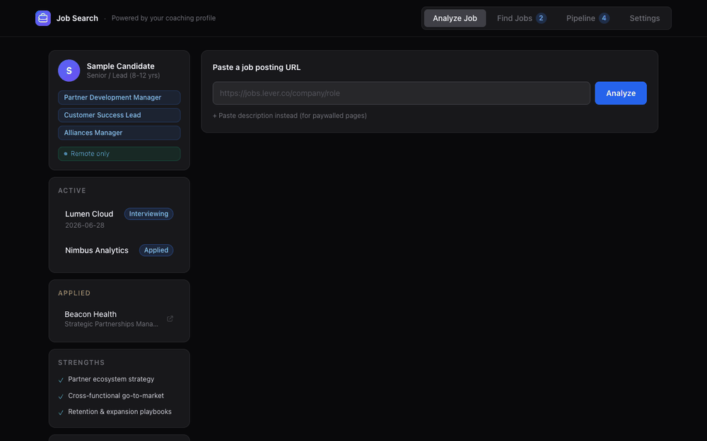
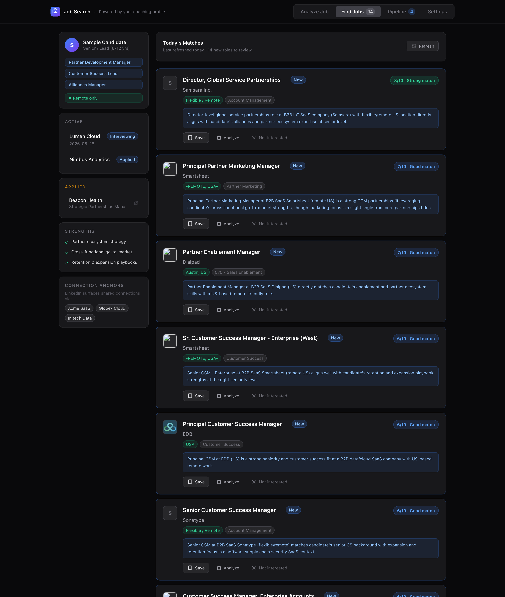
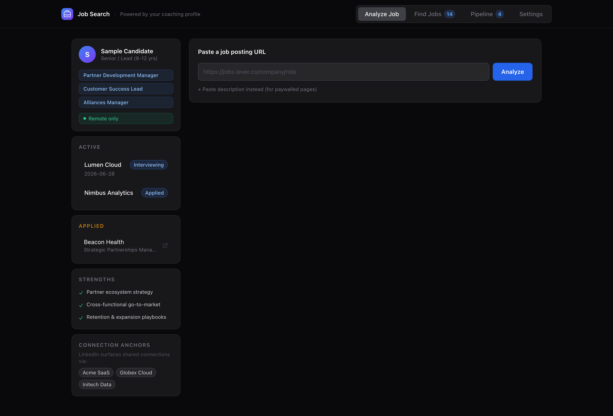
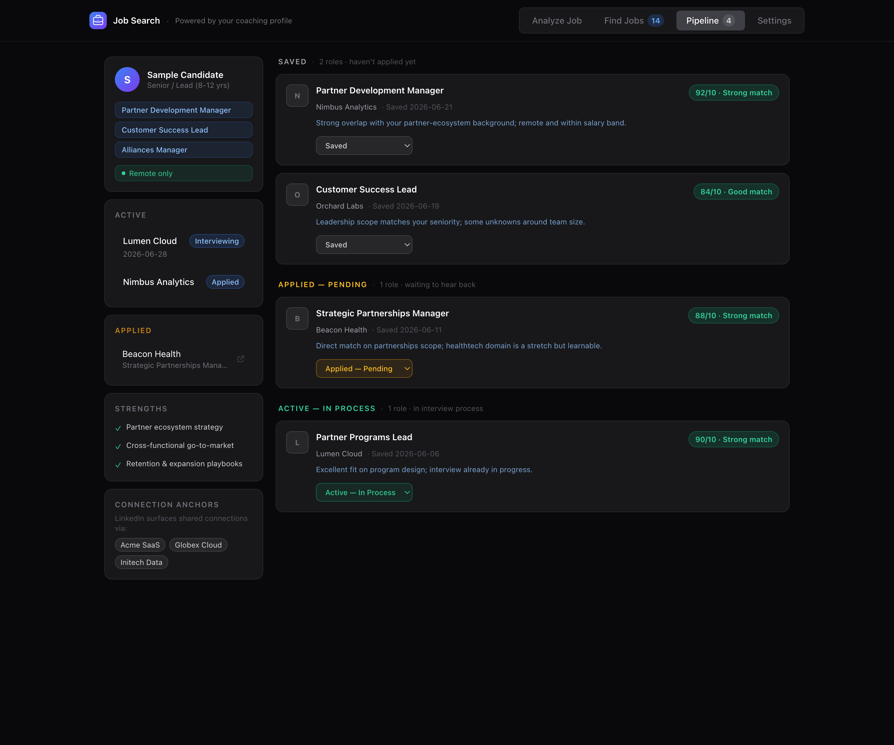

# Job Search Tool

An AI-powered job-search dashboard. It aggregates remote and Greenhouse-board
roles, scores each one against your profile with Claude (fit score, why it fits,
concerns), and bundles company research and interview prep — then tracks your
pipeline and runs an automated daily search.

> _Screenshots and demo use sample data._

## Demo



## Screenshots

**Find Jobs** — remote roles scanned across job boards and ranked against your profile, each with a Claude-generated fit score and rationale:



**Analyze a Job** — paste a posting URL to get a fit breakdown, plus a sidebar driven by your coaching profile (active interviews, strengths, connection anchors):



**Pipeline** — track everything from saved to applied to in-process:



## Features

- **AI fit scoring** — every job is ranked against your profile (target roles,
  seniority, salary floor, title include/exclude rules, company blacklist) with
  a Claude-generated fit score, "why it fits," and concerns to raise.
- **Resume-aware matching** — upload a resume (PDF or TXT) in Settings; the
  extracted text is injected into every ranking prompt alongside your profile
  for sharper fit scoring.
- **Job aggregation** — pulls remote roles from public boards (RemoteOK) and
  watched company **Greenhouse** boards.
- **Analyze any posting** — paste a job URL (or description) for an on-demand fit
  breakdown, recommended stories to deploy, and an apply/skip/monitor call.
- **Company research** — recent news, interview process, and company signals.
- **Pipeline tracking** — saved → applied → active → archived.
- **Daily automation** — a `launchd` job runs the search every morning so new
  matches are waiting for you.

## Technical highlights

- **Multi-source aggregation** — fans out to five job sources in parallel
  (RemoteOK, Jobicy, We Work Remotely, The Muse, and per-company **Greenhouse**
  boards via the `boards-api`) with `Promise.all`, normalizing each into a
  single `RemoteJob` shape.
- **Profile-aware filtering** — applies title include/exclude rules, a salary
  floor, a company blacklist, and US-eligibility heuristics before anything
  reaches the model.
- **LLM ranking with structured output** — batches candidates to Claude
  (`claude-sonnet-4-6`) and parses a strict JSON contract back into per-job fit
  scores, rationales, and concerns; a separate single-job analyze route does the
  same for a pasted posting.
- **Coaching-profile integration** — a small regex parser reads a Markdown
  `coaching_state.md` into a typed profile (target roles, seniority, strengths,
  active interview loops) that drives both ranking context and the UI sidebar.
- **Hands-off automation** — a `launchd` agent calls the daily-search endpoint
  each morning so new ranked matches are waiting without opening the app.
- **Resume extraction** — an upload route parses PDF/TXT resumes server-side
  (`pdf-parse`) into plain text, stored as a profile override and merged into
  the ranking prompt context.

## Stack

Next.js 14 · React 18 · TypeScript · Tailwind CSS · Anthropic Claude API

## Setup

```bash
npm install
cp .env.local.example .env.local   # add your ANTHROPIC_API_KEY
npm run dev                         # http://localhost:3000
```

The app reads your candidate profile from a coaching-state file; set
`COACHING_STATE_PATH` in `.env.local` to point at yours, or use the in-app
Profile overrides.

### Daily search (optional)

`com.jobsearch.daily.plist` registers a `launchd` agent that hits the app's
daily-search endpoint each morning. Edit the paths, then:

```bash
cp com.jobsearch.daily.plist ~/Library/LaunchAgents/
launchctl load ~/Library/LaunchAgents/com.jobsearch.daily.plist
```

## Notes

Single-user by design — runs locally against your own `.env.local` and a local
`data/jobs-store.json`. Both are gitignored; nothing personal is committed.

## License

MIT — see [LICENSE](LICENSE).
